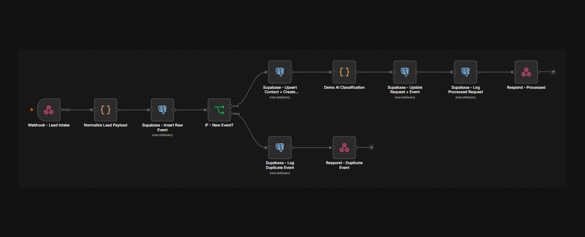

# CRM Lead Router Case Study

This is a practical n8n + Supabase demo for cleaning up messy inbound leads before they reach a CRM.

It shows how to receive a webhook, store the raw event, avoid duplicate webhook processing, reuse existing contacts, keep request history, classify the enquiry, and write an audit trail.

The main thing this repo demonstrates is simple:

Same event, skip it. Same person, new request, keep it.

## Why This Exists

Lead automation usually does not fail because the tools cannot connect. It fails in the handoff between messy real-world input and the CRM.

The common problems are:

- webhooks retry and create duplicate records
- the same contact submits more than once
- repeated data gets mistaken for a duplicate enquiry
- CRMs fill with duplicate contacts
- form payloads arrive in different shapes
- nobody can see what happened when something breaks

This demo was shaped by a real workplace problem: inbound leads arriving from different sources, repeat enquiries being hard to track, and CRM hygiene depending too much on manual admin.

The goal here is not to build a full CRM. It is to show the small but important workflow decisions that keep lead routing clean.

## The Main Idea

This demo separates three jobs:

- `event_id` protects the workflow from processing the same webhook delivery twice.
- `email` protects the CRM from duplicate contacts.
- `lead_requests` protects the business from losing repeat enquiries.

That means:

- Same `event_id` = duplicate webhook retry, so skip it.
- Same `email` with a different `event_id` = same contact, new enquiry, so reuse the contact and create a new request.

This distinction is the centre of the project.

## What the Demo Does

```text
Webhook
  -> Normalize payload
  -> Store raw event
  -> Check event_id
  -> Upsert contact
  -> Create request
  -> Classify request
  -> Update records
  -> Write audit log
  -> Respond
```

The workflow runs locally in n8n and writes to Supabase Postgres.

## Workflow Canvas



## Data Model

- `lead_events` = raw webhook events and event-level idempotency
- `contacts` = deduplicated people or business contacts
- `lead_requests` = individual enquiries linked to contacts
- `lead_event_logs` = audit trail

The schema is in `sql/schema.sql`.

## Test Scenarios

1. New contact, new request
   - `event_id = test-003`
   - `email = sarah@example.com`
   - Expected: contact created, request created, request classified.

2. Duplicate webhook retry
   - same `event_id = test-003`
   - Expected: no new contact, no new request, duplicate event logged.

3. Existing contact, new request
   - `event_id = test-004`
   - same `email = sarah@example.com`
   - Expected: same contact reused, second request created, request classified.

## PowerShell Tests

Send a new lead:

```powershell
Invoke-RestMethod `
  -Uri "http://localhost:5678/webhook-test/lead-router-intake" `
  -Method Post `
  -ContentType "application/json" `
  -Body '{
    "event_id": "test-003",
    "first_name": "Sarah",
    "last_name": "Jones",
    "email": "sarah@example.com",
    "phone": "+447111111111",
    "company_name": "Jones Plant Hire",
    "message": "We need help automating missed-call follow-up and website enquiries.",
    "urgency": "high",
    "heard_about_us": "Website"
  }'
```

Expected response:

```json
{
  "ok": true,
  "event_id": "test-003",
  "status": "processed",
  "message": "Lead event processed, contact deduped, request created, and classification logged"
}
```

Run the same request again with `event_id` set to `test-003`.

Expected response:

```json
{
  "ok": true,
  "event_id": "test-003",
  "status": "duplicate_event",
  "message": "Duplicate webhook event_id skipped"
}
```

Now send a new enquiry from the same contact:

```powershell
Invoke-RestMethod `
  -Uri "http://localhost:5678/webhook-test/lead-router-intake" `
  -Method Post `
  -ContentType "application/json" `
  -Body '{
    "event_id": "test-004",
    "first_name": "Sarah",
    "last_name": "Jones",
    "email": "sarah@example.com",
    "phone": "+447111111111",
    "company_name": "Jones Plant Hire",
    "message": "We now need website enquiry routing into our CRM as well.",
    "urgency": "medium",
    "heard_about_us": "Existing contact"
  }'
```

Expected database result:

- `contacts` still has one Sarah row.
- `lead_requests` has two rows linked to Sarah.
- `lead_event_logs` includes `request_classified` and `duplicate_event`.

## Why the Classifier Is Mocked

The classifier is deterministic so the demo can run without an OpenAI key.

In production, this node would be replaced with OpenAI structured outputs using the same JSON schema:

```json
{
  "intent": "automation | website | seo | other",
  "urgency": "low | medium | high",
  "company_size_estimate": "solo | small | medium | unknown",
  "qualification_score": 1,
  "summary": "Short summary of the request",
  "recommended_action": "call | email | nurture | disqualify"
}
```

The important part is that the workflow gets predictable JSON back, not free text that later nodes have to guess at.

## Running the Demo

1. Run `sql/schema.sql` in Supabase.
2. Import the n8n workflow JSON from `workflows/`.
3. Add your own Supabase Postgres credentials to the Postgres nodes.
4. Click `Execute workflow` in n8n.
5. Send the PowerShell test requests.
6. Check `contacts`, `lead_requests`, `lead_events` and `lead_event_logs`.

Do not commit real credentials. Keep Supabase, OpenAI, HubSpot and Slack secrets in local environment variables or n8n credentials.

## What Is Not Included

This repo does not include:

- live HubSpot integration
- live OpenAI integration
- Slack approval
- production webhook signature verification
- monitoring or alerting

That is deliberate. The repo focuses on the core CRM logic first: receive the lead, avoid duplicate processing, reuse contacts, keep request history, classify the request and log what happened.

## Production Version

A production version would add:

- production n8n webhook URL instead of `webhook-test`
- signed webhook verification where supported
- HubSpot Contacts and Deals/Tickets
- OpenAI structured outputs
- Slack approval before outbound emails
- retries and error handling around external APIs
- monitoring for failed executions
- secure credential storage

The data model would stay broadly the same: raw events, deduplicated contacts, linked requests and audit logs.

## Repo Contents

```text
README.md
.env.example
.gitignore
docs/
screenshots/
sql/
workflows/
```
